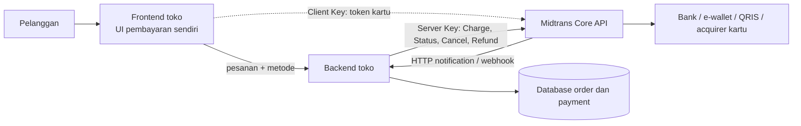
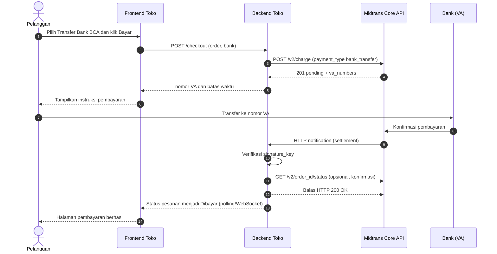
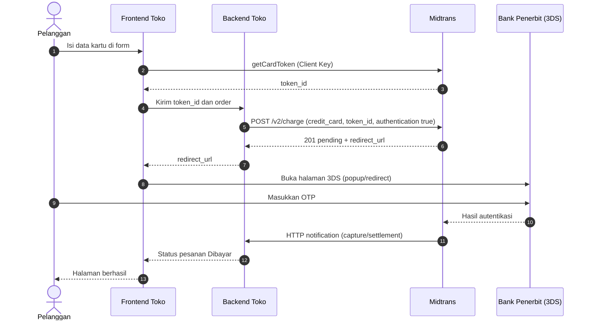
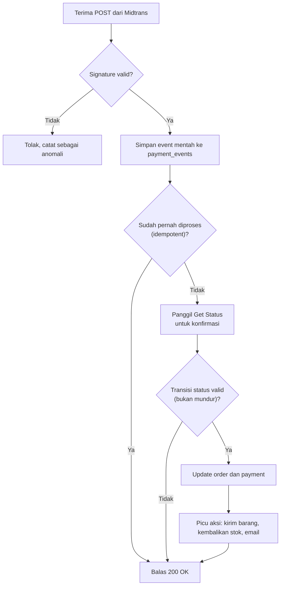
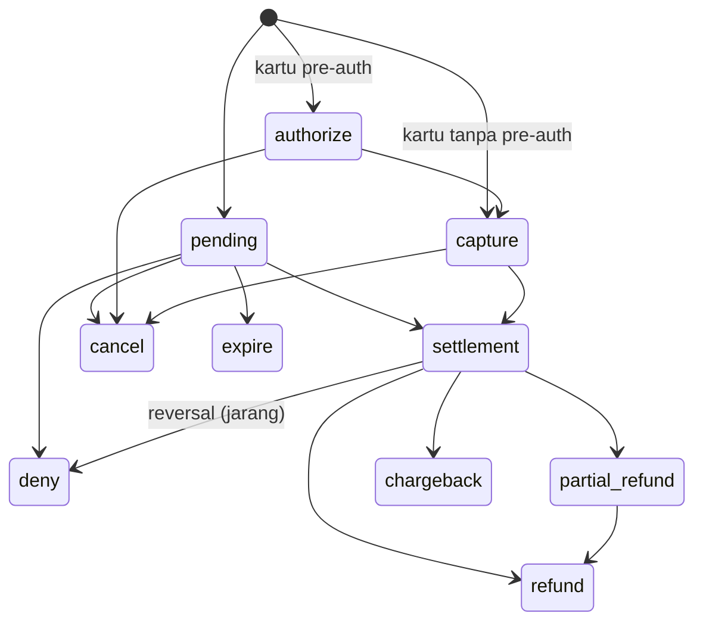
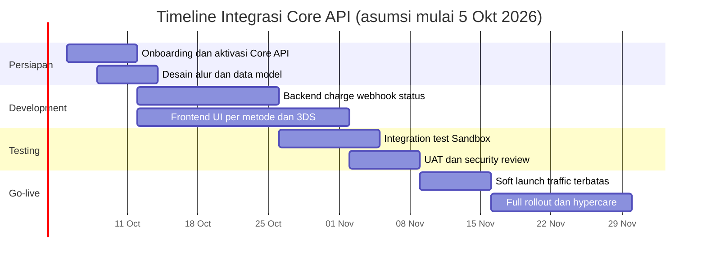

# Strategi Integrasi Midtrans Core API (Custom Interface)

**Kelompok 4 · Business Analyst & Product Strategy Bootcamp (BAPS20) · Basic Software Development**
Draft konten deck per slide · Disusun 20 September 2026 · Deadline pengumpulan: Selasa, 22 September 2026, 23.30 WIB (PDF, via LMS)

---

## Cara memakai dokumen ini

- Satu blok **Slide N** = satu slide di deck. Tiap slide punya *Isi slide* (poin singkat untuk ditampilkan), *Catatan pembicara* (narasi saat presentasi), *Visual* (saran diagram/gambar), dan *Sumber*.
- Tanda yang perlu kamu tindak lanjuti:
  - `[ISI]` = data yang harus kamu isi sendiri (misalnya angka baseline).
  - `[ASUMSI]` = angka/keputusan buatan tim untuk skenario studi kasus, bukan fakta dari Midtrans. Sesuaikan atau jelaskan dasarnya saat presentasi.
  - `[SCREENSHOT n]` = tempat screenshot dari Postman/Dashboard Sandbox milikmu sendiri.
- Fakta teknis (endpoint, alur, status transaksi, signature key) disusun dari dokumentasi Midtrans yang dibuka pada 20 September 2026. Dokumentasi bisa berubah, jadi **cek ulang bagian yang ditandai di Lampiran D sebelum finalisasi**.
- Semua tabel penilaian (misalnya Tinggi/Sedang/Rendah) adalah **penilaian tim yang subjektif**, bukan klaim resmi Midtrans.

### Skenario dan asumsi studi kasus

| Aspek | Asumsi |
|---|---|
| Perusahaan | Startup e-commerce fiktif `[NamaStartup]` yang belum punya sistem pembayaran memadai |
| Fokus kelompok | **Custom Interface (Core API)**: UI pembayaran dibuat sendiri, Midtrans menjadi backend pembayaran |
| Metode pembayaran (scope) | Virtual Account bank (BCA, BNI, BRI), QRIS/GoPay, dan kartu kredit/debit dengan 3DS `[ASUMSI]` |
| Tim | 1 PM, 2 backend, 1 frontend, 1 QA (+ dukungan finance, CS, legal secara paruh waktu) `[ASUMSI]` |
| Durasi | 8 minggu sampai full rollout, termasuk hypercare `[ASUMSI]` |

---

# BAGIAN A — Konteks dan Masalah Bisnis

## Slide 1 — Judul

**Isi slide**
- **Integrasi Midtrans Core API: Membangun Checkout Sendiri untuk Mengurangi Kehilangan Pelanggan di Tahap Pembayaran**
- Kelompok 4 · Custom Interface (Core API)
- Nama anggota `[ISI]` · Mentor: Mas Ikhsan · BAPS20

**Catatan pembicara:** Perkenalkan tim dan fokus kelompok. Tekankan bahwa presentasi ini menjawab pertanyaan strategis: *apakah dan bagaimana* startup sebaiknya membangun sendiri checkout-nya di atas Midtrans Core API.

**Visual:** Judul besar, logo/nama startup fiktif, ilustrasi sederhana alur keranjang → pembayaran → konfirmasi.

---

## Slide 2 — Masalah bisnis, tujuan, dan indikator keberhasilan

**Isi slide**
- **Masalah (dari case):** platform belum punya sistem pemrosesan pembayaran yang baik, sehingga calon pelanggan hilang di tahap pembayaran.
- **Tujuan:** menyediakan pembayaran multi-metode dengan pengalaman yang konsisten dengan brand, dan status pesanan yang ter-update otomatis.
- **Kenapa Core API:** kontrol penuh atas tampilan dan alur per metode pembayaran, serta bisa dipakai di web, aplikasi, maupun kanal non-web di masa depan.
- **Indikator keberhasilan (KPI):**

| KPI | Baseline | Target |
|---|---|---|
| Payment success rate | `[ISI]` | `[ASUMSI]` |
| Conversion rate checkout → dibayar | `[ISI]` | `[ASUMSI]` |
| Cart abandonment di tahap pembayaran | `[ISI]` | `[ASUMSI]` |
| Pesanan berstatus benar otomatis (tanpa koreksi manual) | `[ISI]` | `[ASUMSI]` mendekati 100% |
| Waktu klik "Bayar" sampai instruksi pembayaran tampil | `[ISI]` | `[ASUMSI]` |

**Catatan pembicara:** Hubungkan teknologi dengan hasil bisnis. Angka baseline diambil dari data internal startup (analytics/checkout funnel). Jika tidak ada, jelaskan bahwa langkah pertama adalah memasang pengukuran funnel pembayaran sebelum go-live.

**Visual:** Funnel checkout (Keranjang → Pilih metode → Bayar → Berhasil) dengan titik "drop-off" ditandai.

**Sumber:** Case "API Payment Gateways Implementation" (dokumen tugas).

---

# BAGIAN B — Gambaran Umum Midtrans dan Posisi Core API

## Slide 3 — Pilihan integrasi Midtrans dan posisi Kelompok 4

**Isi slide**

| Opsi integrasi | Ringkasan | Cocok untuk |
|---|---|---|
| **Built-in Interface (Snap)** | UI pembayaran siap pakai; metode baru otomatis muncul; dokumentasi menyebutnya opsi yang direkomendasikan dan tercepat | Integrasi cepat |
| Native Mobile SDK | Fitur Snap yang dioptimalkan untuk Android/iOS native | Aplikasi mobile native |
| **Custom Interface (Core API)** ⬅ *Kelompok 4* | Kamu membuat UI sendiri dan memanggil Payment API langsung; UI bisa dikustomisasi per metode | Kontrol penuh UI, perangkat non-web (POS, vending, IoT) |
| Payment Link / via API | Halaman bayar dari Midtrans, dibagikan lewat tautan; bisa diotomatisasi via API | Invoice, jualan di sosial media |
| CMS Plugin / E-commerce Platform | Pasang plugin (WooCommerce, Magento, dll.) atau platform (Shopify, dll.) | Yang sudah memakai CMS/platform tersebut |

**Catatan pembicara:** Posisikan Core API sebagai pilihan strategis, bukan pilihan default: paling fleksibel tetapi menuntut usaha dan tanggung jawab teknis paling besar. Kelompok lain membahas opsi lainnya.

**Visual:** Spektrum "Cepat & terbatas ← → Fleksibel & butuh usaha", dengan Snap di kiri dan Core API di kanan.

**Sumber:** https://docs.midtrans.com/docs/payment-overview

---

## Slide 4 — Apa itu Core API dan bagaimana arsitekturnya

**Isi slide**
- Core API adalah **RESTful web service** dengan payload **JSON**, untuk integrasi ke sistem apa pun yang terhubung internet.
- Kamu memakai **UI pembayaran sendiri** dan menghubungkannya ke Payment API Midtrans.
- **Sandbox aktif secara default** untuk uji coba. Untuk **Production**, Core API perlu **mengajukan aktivasi** dan ditinjau tim Midtrans.
- **Dua kunci berbeda:**
  - **Server Key**: rahasia, hanya di backend. Dipakai di header `Authorization` (Basic Auth: Server Key sebagai username, password kosong, lalu di-Base64).
  - **Client Key**: publik, dipakai di frontend untuk tokenisasi kartu.
- **Lingkungan:** Sandbox `https://api.sandbox.midtrans.com` · Production `https://api.midtrans.com`. Key Sandbox dan Production berbeda.

**Diagram arsitektur (Mermaid, tampil otomatis di GitHub):**



**Catatan pembicara:** Tekankan pemisahan tanggung jawab: Server Key tidak boleh pernah sampai ke browser. Frontend hanya memegang Client Key untuk mengambil token kartu.

**Sumber:** https://docs.midtrans.com/docs/custom-interface-core-api · https://docs.midtrans.com/reference/authorization

---

## Slide 5 — Metode pembayaran yang tersedia dan scope kita

**Isi slide**
- Midtrans mendukung kartu (kredit/debit), bank transfer, e-wallet, over the counter, dan cardless credit; panduan integrasi Core API tersedia untuk masing-masing.
- **Scope proyek ini `[ASUMSI]`:**

| Prioritas | Metode | Alasan |
|---|---|---|
| Fase 1 | Virtual Account (BCA, BNI, BRI) | Umum dipakai, alur relatif sederhana |
| Fase 1 | QRIS / GoPay | Cepat dan populer, kedaluwarsa singkat |
| Fase 2 | Kartu kredit/debit + 3DS | Alur paling kompleks dan sensitif keamanan |
| Nanti | Mandiri Bill, minimarket, cardless credit | Setelah alur inti stabil |

- **Catatan aktivasi:** setiap metode perlu aktif di akun. Metode yang tersedia dapat berbeda antara akun perorangan dan badan usaha, jadi cek dokumentasi sebelum menjanjikan metode ke bisnis.

**Catatan pembicara:** Alasan bertahap: mengurangi risiko dan mempercepat nilai pertama ke pelanggan. Kartu ditunda ke fase 2 karena menuntut penanganan 3DS dan pertimbangan keamanan yang lebih berat.

**Visual:** Roadmap 3 kolom (Fase 1 / Fase 2 / Nanti) dengan logo metode pembayaran.

**Sumber:** https://docs.midtrans.com/docs/payment-overview · https://docs.midtrans.com/docs/custom-interface-core-api

---

# BAGIAN C — Fungsi API dan Rencana Implementasi

## Slide 6 — Fungsi API yang akan dipakai

**Isi slide**

Base URL Sandbox: `https://api.sandbox.midtrans.com` · Production: `https://api.midtrans.com`
Header wajib: `Accept: application/json`, `Content-Type: application/json`, `Authorization: Basic Base64(ServerKey:)`

| Fungsi | Endpoint | Kegunaan | Dipanggil oleh |
|---|---|---|---|
| **Charge** | `POST /v2/charge` | Membuat transaksi per metode (`bank_transfer`, `gopay`, `qris`, `credit_card`, dll.) | Backend |
| **Get Card Token** | JS library `midtrans-new-3ds.min.js` (`MidtransNew3ds.getCardToken`) | Menukar data kartu menjadi `token_id` tanpa data kartu melewati server toko | Frontend (Client Key) |
| **Get Status** | `GET /v2/{order_id}/status` | Cek status terkini; dipakai untuk verifikasi dan rekonsiliasi | Backend |
| **Cancel** | `POST /v2/{order_id}/cancel` | Membatalkan transaksi berstatus pending/capture | Backend |
| **Expire** | `POST /v2/{order_id}/expire` | Mengakhiri transaksi pending secara manual *(cek API Reference untuk detail)* | Backend |
| **Refund** | `POST /v2/{order_id}/refund` | Pengembalian dana untuk transaksi settlement *(hanya metode tertentu; cek API Reference)* | Backend |
| **HTTP Notification** | (Midtrans → URL kita) | Pemberitahuan setiap perubahan status transaksi | Midtrans → Backend |
| **Deactivate VA** | `POST /v2/virtual-account/va-number/deactivate` | Menonaktifkan VA yang sudah dibuat (khusus Core API) | Backend |

`order_id` juga bisa diganti dengan `transaction_id` dari Midtrans, berguna jika `order_id` mengandung karakter tak biasa.

**Catatan pembicara:** Bagi fungsi menjadi tiga kelompok: membuat transaksi (Charge, Token), memantau (Status, Notification), dan mengelola (Cancel, Expire, Refund, Deactivate VA).

**Sumber:** https://docs.midtrans.com/docs/coreapi-core-api-bank-transfer-integration · https://docs.midtrans.com/docs/get-status-api-requests · https://docs.midtrans.com/docs/transaction-status-cycle · https://docs.midtrans.com/reference/refund-transaction · https://docs.midtrans.com/reference/deactive-va-api

---

## Slide 7 — Rencana implementasi langkah demi langkah

**Isi slide**

| Fase | Aktivitas utama | Output / kriteria selesai |
|---|---|---|
| **1. Onboarding** | Daftar akun Midtrans; ambil Sandbox Server Key dan Client Key (Settings > Access Keys); **ajukan aktivasi Production Core API sejak awal**; aktifkan metode yang dibutuhkan | Key Sandbox tersedia; permohonan aktivasi terkirim |
| **2. Desain** | Rancang state machine order dan payment; skema DB (`orders`, `payments`, `payment_events`); mapping status Midtrans → status internal; kebijakan expiry, retry, dan refund | Dokumen desain disetujui PM dan backend |
| **3. Backend** | Service Charge per metode; endpoint webhook (verifikasi signature, idempotent); sinkronisasi via Get Status; Cancel/Expire; logging dan alert | Semua endpoint lulus tes di Sandbox |
| **4. Frontend** | UI per metode: instruksi VA, QR/deeplink, form kartu + 3DS; countdown expiry; halaman hasil dan error | UI sesuai desain dan lolos QA |
| **5. Testing** | Skenario sukses, gagal, expire, notifikasi terlambat/berulang, 3DS, refund; uji beban ringan | Test report; bug kritikal = 0 |
| **6. Go-live** | Ganti key dan URL ke Production; konfigurasikan Notification URL; soft launch bertahap; monitoring dan hypercare | Metrik KPI mulai terpantau |

**Catatan pembicara:** Sorot dua hal yang sering terlupa: (1) aktivasi Production butuh waktu review, jadi diajukan di minggu pertama; (2) desain status dan webhook dibuat sebelum coding karena di situ sumber bug terbesar.

**Visual:** Diagram 6 langkah horizontal (chevron), tiap langkah punya ikon dan penanggung jawab.

**Sumber:** https://docs.midtrans.com/docs/custom-interface-core-api · https://docs.midtrans.com/docs/coreapi-core-api-bank-transfer-integration

---

## Slide 8 — Alur integrasi per metode pembayaran

**Isi slide**

| Metode | Alur singkat | Hal khusus |
|---|---|---|
| **Virtual Account** | 1) Charge dengan `payment_type: bank_transfer` dan `bank` → 2) respons berisi `va_numbers` → 3) tampilkan nomor VA dan instruksi → 4) tunggu notifikasi | Kedaluwarsa default 24 jam (bisa diatur, min 20 detik, maks 180 hari); nomor VA bisa dikustomisasi |
| **QRIS / GoPay** | 1) Charge dengan `payment_type: gopay` (atau `qris`) → 2) respons berisi `actions[]` berisi URL QR/deeplink → 3) tampilkan QR atau tombol buka aplikasi → 4) tunggu notifikasi | Kedaluwarsa default GoPay 15 menit; jangan set di bawah 15 menit |
| **Kartu + 3DS** | 1) Frontend ambil `token_id` → 2) backend Charge `payment_type: credit_card` dengan `token_id` → 3) jika `pending` dan ada `redirect_url`, buka halaman 3DS → 4) tunggu notifikasi/hasil | Jika langsung `capture` + `fraud_status: accept`, tidak perlu 3DS |

**Catatan pembicara:** Tiga metode ini mewakili tiga pola berbeda: "tampilkan kode bayar" (VA), "tampilkan QR/deeplink" (QRIS/GoPay), dan "autentikasi di halaman pihak ketiga" (kartu 3DS).

**Sumber:** https://docs.midtrans.com/docs/coreapi-core-api-bank-transfer-integration · https://docs.midtrans.com/docs/coreapi-e-money-integration · https://docs.midtrans.com/docs/coreapi-card-payment-integration · https://docs.midtrans.com/docs/gopay-qris-pos-integration

---

## Slide 9 — Desain status: memetakan status Midtrans ke status pesanan

**Isi slide**

| `transaction_status` Midtrans | Arti | Status pesanan internal | Aksi sistem |
|---|---|---|---|
| `pending` | Menunggu pelanggan membayar | Menunggu pembayaran | Tampilkan instruksi dan countdown |
| `settlement` (atau `capture` dengan `fraud_status: accept`) | Pembayaran sukses | **Dibayar** | Proses pesanan |
| `deny` | Ditolak provider atau FDS | Ditolak | Tawarkan metode lain |
| `expire` | Lewat batas waktu | Kedaluwarsa | Kembalikan stok |
| `cancel` | Dibatalkan dari sisi kita/provider | Dibatalkan | Kembalikan stok |
| `refund` / `partial_refund` | Dana dikembalikan | Dikembalikan | Update pembukuan |
| `capture` dengan `fraud_status: challenge` | Perlu ditinjau | Tinjau manual | Jangan kirim barang dulu |

**Aturan penting:**
- Kondisi sukses menurut dokumentasi: `status_code = 200`, `fraud_status = accept` (jika ada), dan `transaction_status` = `settlement` atau `capture`.
- Notifikasi bisa datang **terlambat** atau **tidak berurutan** (misalnya `settlement` datang sebelum `pending`); jangan menurunkan status ke tahap yang lebih awal.
- Aman memanggil Get Status pada setiap notifikasi untuk memastikan status terkini.

**Catatan pembicara:** Ini "otak" integrasi. Kalau slide ini benar, sebagian besar bug pembayaran bisa dicegah.

**Sumber:** https://docs.midtrans.com/docs/transaction-status-cycle · https://docs.midtrans.com/docs/https-notification-webhooks · https://docs.midtrans.com/reference/handle-async-payment

---

# BAGIAN D — Use Case dan Sequence Diagram

## Slide 10 — Use case bisnis

**Isi slide**

| # | Use case | Fungsi API yang dipakai | Hasil bisnis |
|---|---|---|---|
| UC1 | Pelanggan bayar via Virtual Account | Charge → Notification | Pesanan otomatis "Dibayar" tanpa cek manual |
| UC2 | Pelanggan bayar via QRIS/GoPay | Charge → Notification | Pembayaran cepat, mengurangi pembatalan |
| UC3 | Pelanggan bayar kartu dengan 3DS | Token → Charge → 3DS → Notification | Pembayaran kartu aman dan terverifikasi |
| UC4 | Pelanggan tidak membayar | Notification `expire` / Expire API | Stok kembali otomatis |
| UC5 | Pelanggan membatalkan sebelum bayar | Cancel | Transaksi bersih, tidak ada VA/QR menggantung |
| UC6 | Pengembalian dana | Refund (metode yang mendukung) | Proses retur terukur |
| UC7 | Notifikasi terlambat/hilang | Get Status (rekonsiliasi berkala) | Status tidak "nyangkut" |

**Catatan pembicara:** Pilih 2–3 use case untuk dijelaskan mendalam; sisanya cukup disebut. UC7 menunjukkan kematangan desain karena menangani kondisi tidak ideal.

**Visual:** Diagram use case sederhana (aktor: Pelanggan, Sistem Toko, Midtrans, Tim Finance).

---

## Slide 11 — Sequence diagram: pembayaran Virtual Account



**Catatan pembicara:** Tunjukkan dua jalur terpisah: jalur **permintaan** (kita ke Midtrans) dan jalur **kabar** (Midtrans ke kita). Pelanggan tidak pernah "memberi tahu" bahwa sudah bayar; kepastian datang dari webhook yang diverifikasi.

---

## Slide 12 — Sequence diagram: pembayaran kartu dengan 3DS



**Catatan pembicara:** Data kartu dikirim dari browser langsung ke Midtrans untuk ditukar token, sehingga tidak melewati server toko. Backend hanya menerima `token_id`.

**Sumber:** https://docs.midtrans.com/docs/coreapi-card-payment-integration · https://github.com/Midtrans/advanced-faq-site/blob/master/credit-card-fullpayment.md

---

## Slide 13 — Alur penanganan webhook di backend



**Isi slide (poin kunci)**
- Balas **HTTP 200 secepat mungkin**. Timeout Midtrans 30 detik; targetkan respons di bawah 5 detik dan kerjakan proses berat secara asynchronous.
- Simpan setiap event mentah untuk audit.
- Jadwalkan job rekonsiliasi yang memanggil Get Status untuk transaksi `pending` yang terlalu lama.

**Sumber:** https://docs.midtrans.com/reference/handle-async-payment · https://docs.midtrans.com/docs/https-notification-webhooks · https://docs.midtrans.com/docs/technical-faq

---

## Slide 14 — Siklus status transaksi



**Isi slide**
- `settlement` = dana sudah masuk; `capture` untuk kartu = sukses dan akan settle sesuai jadwal bank.
- **Reversal:** pada Permata Bank Transfer, Mandiri Bill Payment, dan Indomaret, dalam kasus jarang `settlement` bisa berubah menjadi `deny` (biasanya dalam 1-5 menit). Anggap pesanan **tidak dibayar** dan jangan kirim barang.

**Catatan pembicara:** Diagram ini bisa jadi rujukan "aturan main" antara tim backend, QA, dan finance.

**Sumber:** https://docs.midtrans.com/en/after-payment/status-cycle · https://docs.midtrans.com/docs/transaction-status-cycle

---

# BAGIAN E — Kebutuhan Resource dan Timeline

## Slide 15 — Kebutuhan resource `[ASUMSI]`

**Isi slide**

| Kategori | Kebutuhan | Peran dalam proyek |
|---|---|---|
| **Teknis** | 2 Backend developer | Service Charge, webhook, sinkronisasi status, Cancel/Expire/Refund |
| | 1 Frontend developer | UI per metode, form kartu, penanganan 3DS, countdown expiry |
| | 1 QA engineer | Skenario uji Sandbox, regression, uji notifikasi |
| | DevOps/Security (paruh waktu) | Secret management, HTTPS endpoint webhook, logging dan alert, review keamanan |
| **Non-teknis** | Product Manager | Prioritas, KPI, koordinasi, keputusan scope |
| | Finance/Accounting | Rekonsiliasi dan settlement, kebijakan refund |
| | Customer Support | SOP komplain "sudah bayar tapi status belum berubah" |
| | Legal/Compliance | Dokumen registrasi merchant, kebijakan privasi dan refund |
| **Tools** | Akun Sandbox Midtrans, Postman (+ Postman Collection resmi Midtrans), Git, endpoint HTTPS publik untuk uji webhook, monitoring/logging | |
| **Biaya** | Biaya transaksi Midtrans (cek halaman pricing resmi), infrastruktur, waktu tim | `[ISI]` |

**Catatan pembicara:** Bandingkan singkat dengan Snap: Core API butuh porsi frontend dan QA lebih besar karena kita membangun dan menguji UI sendiri.

**Sumber:** https://docs.midtrans.com/docs/midtrans-api-postman-collection · https://docs.midtrans.com/docs/pricing

---

## Slide 16 — Timeline 8 minggu `[ASUMSI]`

| Minggu | Fase | Fokus |
|---|---|---|
| 1 | Persiapan | Akun, key Sandbox, **ajukan aktivasi Production Core API**, aktivasi metode, desain awal |
| 1-2 | Desain | State machine, skema DB, mapping status, kebijakan expiry/refund |
| 2-4 | Development | Backend (Charge, webhook, Status) dan frontend (UI per metode, 3DS) |
| 4-5 | Integration test | Skenario sukses/gagal/expire/notifikasi terlambat di Sandbox |
| 6 | UAT dan security review | Uji bisnis, review keamanan, kesiapan operasional (SOP CS/finance) |
| 7 | Soft launch | Production dengan traffic terbatas (feature flag), pantau KPI |
| 8 | Full rollout dan hypercare | Buka untuk semua pelanggan, pantau intensif, perbaikan cepat |
| Setelah itu | Dukungan berkelanjutan | Metode baru, optimasi, pemantauan versi API |



**Catatan pembicara:** Jelaskan bahwa durasi adalah estimasi berbasis asumsi tim kecil. Faktor yang paling bisa menggeser jadwal: waktu review aktivasi Production dan kompleksitas 3DS.

---

# BAGIAN F — Analisis Pro dan Kontra

## Slide 17 — Core API dibandingkan Snap dan Payment Link via API

**Isi slide**

Penilaian di bawah adalah **penilaian tim (subjektif)** berdasarkan dokumentasi Midtrans.

| Faktor | Core API (Custom) | Snap (Built-in) | Payment Link via API |
|---|---|---|---|
| **Kemudahan implementasi** | Rendah-Sedang: UI dan alur per metode dibuat sendiri | **Tinggi:** disebut dokumentasi sebagai cara tercepat | Tinggi: integrasi via API mirip Snap |
| **Kontrol UX dan brand** | **Tinggi:** UI bisa dikustomisasi per metode | Sedang: nama, logo, warna tema dapat diatur | Rendah-Sedang: halaman dari Midtrans |
| **Metode pembayaran baru** | Harus diintegrasikan manual | Otomatis muncul setelah diaktifkan | Ikut halaman Midtrans |
| **Beban keamanan dan compliance** | **Lebih besar di sisi merchant** (lihat catatan) | Lebih ringan (UI dihosting Midtrans) | Lebih ringan |
| **Fleksibilitas kanal** | **Tinggi:** web, app, POS, IoT | Web dan app (WebView) | Terutama tautan/invoice |
| **Pemeliharaan** | Lebih besar (UI + integrasi) | Lebih kecil | Kecil |

*Catatan compliance:* dalam tabel perbandingan resmi, use case Core API disebut untuk bisnis yang "PCI compliant". Untuk metode non-kartu (VA, QRIS/GoPay) beban ini lebih ringan, sedangkan untuk kartu sebaiknya dikonfirmasi ke tim Midtrans mengenai persyaratan yang berlaku bagi merchant.

**Catatan pembicara:** Ini slide paling analitis. Pesannya: Core API bukan "lebih baik", melainkan "lebih fleksibel dengan harga usaha dan tanggung jawab lebih besar". Pilihan tergantung seberapa penting kontrol UX bagi bisnis.

**Sumber:** https://docs.midtrans.com/docs/payment-overview

---

## Slide 18 — Kelebihan dan kekurangan Core API

**Isi slide**

| ✅ Kelebihan | ⚠️ Kekurangan |
|---|---|
| Kontrol penuh tampilan dan alur pembayaran; pengalaman konsisten dengan brand | Usaha pengembangan lebih besar (UI per metode) dan pemeliharaan berkelanjutan |
| Bisa dikustomisasi per metode; mendukung fitur lanjutan (mis. recurring charge sesuai permintaan) | Metode pembayaran baru tidak muncul otomatis; harus dibangun dan diuji |
| Berlaku untuk web, app, POS, IoT: satu backend, banyak kanal | Tim harus menangani sendiri webhook, sinkronisasi status, reversal, dan 3DS |
| REST + JSON, Sandbox aktif default, library resmi tersedia | Beban keamanan lebih besar (kunci, data kartu, compliance) |
| Ada endpoint pendukung: Status, Cancel, Expire, Refund | Aktivasi Production perlu review; metode tertentu harus diaktifkan per akun |
| | Refund tidak tersedia untuk semua metode (VA bank transfer tidak termasuk) |
| | Ketergantungan pada ketersediaan Midtrans dan bank/provider |

**Catatan pembicara:** Sampaikan kekurangan dengan jujur; nilai tim justru terlihat dari mitigasi yang kita siapkan (Bagian G).

**Sumber:** https://docs.midtrans.com/docs/payment-overview · https://docs.midtrans.com/reference/refund-transaction

---

## Slide 19 — Analisis empat faktor: keamanan, keandalan, skalabilitas, kemudahan implementasi

**Isi slide**

| Faktor | Temuan | Implikasi bagi startup | Strategi ringkas |
|---|---|---|---|
| **Keamanan** | Server Key harus rahasia; notifikasi bertanda `signature_key`; kartu ditokenisasi di frontend | Kebocoran key atau webhook palsu bisa menyebabkan pesanan "dibayar" palsu | Secret manager, verifikasi signature + Get Status, tidak menyimpan/log data kartu |
| **Keandalan** | Notifikasi bisa terlambat atau tidak berurutan; metode tertentu bisa reversal | Status pesanan bisa salah bila hanya mengandalkan satu notifikasi | Idempotency, state machine, rekonsiliasi berkala, alert |
| **Skalabilitas** | REST API stateless; satu backend untuk banyak kanal | Mudah menambah kanal dan metode di kemudian hari | Antrian untuk proses webhook, desain DB berbasis event |
| **Kemudahan implementasi** | Paling rendah dibanding Snap/Payment Link | Timeline lebih panjang dan butuh QA lebih banyak | Rilis bertahap per metode; pakai library resmi dan Postman Collection |

**Catatan pembicara:** Slide ini menjawab langsung permintaan guidance: evaluasi keamanan, keandalan, skalabilitas, dan kemudahan implementasi.

---

# BAGIAN G — Tantangan, Pertimbangan, dan Mitigasi

## Slide 20 — Tantangan utama dan mitigasi

**Isi slide**

| # | Tantangan | Dampak | Mitigasi |
|---|---|---|---|
| 1 | **Server Key bocor** | Pihak lain bisa membuat/membatalkan transaksi | Simpan di environment variable/secret manager, jangan di kode/frontend, rotasi berkala, key terpisah Sandbox vs Production |
| 2 | **Notifikasi palsu** | Pesanan ditandai dibayar tanpa pembayaran | Verifikasi `SHA512(order_id + status_code + gross_amount + ServerKey)` dan konfirmasi via Get Status; gunakan HTTPS |
| 3 | **Notifikasi terlambat/tidak berurutan** | Status mundur atau salah | Idempotent, aturan transisi status, abaikan status yang "mundur" |
| 4 | **Notifikasi tidak diterima** (endpoint down/lambat) | Pesanan "nyangkut" pending | Respons cepat (di bawah 5 detik), proses asynchronous, cek riwayat notifikasi di Dashboard, job rekonsiliasi Get Status |
| 5 | **Reversal** (`settlement` → `deny`) pada Permata/Mandiri Bill/Indomaret | Barang terkirim padahal dana dibatalkan | Anggap tidak dibayar; tunda pengiriman singkat untuk metode terkait `[ASUMSI]`; alert bila status berubah ke `deny` |
| 6 | **Duplikasi transaksi/`order_id`** | Tagihan ganda, kebingungan pelanggan | `order_id` unik per transaksi, nonaktifkan tombol setelah klik, cek status sebelum membuat transaksi baru |
| 7 | **Kedaluwarsa tidak sinkron dengan UI** | Pelanggan bayar setelah kedaluwarsa | Tampilkan countdown dari data expiry Midtrans; jalankan Expire/Cancel; VA bisa dinonaktifkan via Deactivate VA |
| 8 | **3DS dan penolakan kartu** | Pelanggan berhenti di tengah proses | UX 3DS jelas (popup/redirect), pesan penolakan ramah, tawarkan metode lain |
| 9 | **Kesalahan konfigurasi** (401 key salah, 402 metode belum aktif, 411 token tidak valid/kedaluwarsa) | Transaksi gagal | Mapping error ke pesan operasional, checklist konfigurasi per environment, monitoring |
| 10 | **Refund tidak tersedia untuk semua metode** | Pelanggan VA sulit direfund via API | SOP refund manual oleh finance untuk VA; komunikasikan kebijakan sejak checkout |
| 11 | **Compliance dan privasi** | Risiko hukum | Review legal/security; tidak menyimpan atau mencatat data kartu; kebijakan privasi diperbarui |
| 12 | **Ketergantungan pada satu vendor** | Gangguan menghentikan pembayaran | Monitoring status, halaman status insiden, rencana fallback (mis. Payment Link via API) |
| 13 | **Perbedaan Sandbox vs Production** | Bug baru muncul setelah go-live | Konfigurasi per environment, soft launch bertahap, checklist go-live (Lampiran B) |

**Catatan pembicara:** Pilih 4–5 tantangan paling kritikal untuk dibahas (biasanya #2, #3, #4, #5, #10); sisanya cukup tampil di tabel.

**Sumber:** https://docs.midtrans.com/docs/https-notification-webhooks · https://docs.midtrans.com/docs/transaction-status-cycle · https://docs.midtrans.com/docs/technical-faq · https://docs.midtrans.com/docs/coreapi-core-api-bank-transfer-integration

---

## Slide 21 — Strategi peluncuran, fallback, dan monitoring

**Isi slide**
- **Rilis bertahap:** feature flag per metode → traffic terbatas → semua pelanggan.
- **Fallback:** jika Core API bermasalah, siapkan jalur alternatif (mis. tautan pembayaran via Payment Link API) untuk pesanan yang tertahan.
- **Monitoring wajib:** rasio sukses per metode, jumlah pesanan `pending` melebihi ambang waktu, gagal verifikasi signature, error 4xx/5xx dari Midtrans, latensi webhook.
- **SOP operasional:** alur penanganan komplain "sudah bayar, status belum berubah" (cek Get Status → cek Dashboard → eskalasi).

**Visual:** Dashboard monitoring mock-up sederhana atau checklist "sebelum dan sesudah go-live".

---

# BAGIAN H — Contoh Pemanggilan API (untuk kamu jalankan dan screenshot)

> **Petunjuk:** Bagian ini berisi persiapan, request yang siap dipakai di Postman, dan bentuk respons yang diharapkan. Respons di bawah adalah **ilustrasi bentuk** berdasarkan dokumentasi; nilai asli (ID, nomor VA, waktu) akan berbeda dan **yang kamu tampilkan di deck harus hasil dari Postman milikmu sendiri**. Tempel screenshot di posisi `[SCREENSHOT n]` dan tulis keterangan langkahnya.

## Slide 22 — Persiapan Postman dan autentikasi

**Langkah**
1. Buat akun Midtrans → masuk **Sandbox Dashboard** → **Settings > Access Keys** → salin **Server Key** (berawalan `SB-Mid-server-...`) dan **Client Key**.
2. Di Postman buat **Environment** dengan variabel: `base_url = https://api.sandbox.midtrans.com`, `server_key`, `client_key`. (Opsional: impor Postman Collection resmi Midtrans.)
3. Di tab **Authorization** pilih **Basic Auth**: *Username* = Server Key, *Password* = kosong. Postman akan membuat header `Authorization: Basic Base64(ServerKey:)` otomatis.
4. Tambahkan header `Accept: application/json` dan `Content-Type: application/json`.

`[SCREENSHOT 1: Environment variable Postman (sembunyikan/blur Server Key)]`
`[SCREENSHOT 2: Tab Authorization Basic Auth (blur Server Key)]`

**Keterangan untuk deck:** "Setiap panggilan API wajib diautentikasi. Midtrans memakai Basic Auth dengan Server Key sebagai username dan password kosong."

> ⚠️ **Jangan pernah menampilkan Server Key asli di screenshot atau menaruhnya di GitHub.** Blur bagian key. Key Sandbox memang bukan key produksi, tetapi biasakan disiplin sejak sekarang.

**Sumber:** https://docs.midtrans.com/reference/authorization · https://docs.midtrans.com/docs/api-authorization-headers

---

## Slide 23 — Panggilan 1: Charge Virtual Account BCA

**Request**

`POST {{base_url}}/v2/charge`

```json
{
  "payment_type": "bank_transfer",
  "transaction_details": {
    "order_id": "ORDER-KLP4-001",
    "gross_amount": 44000
  },
  "item_details": [
    { "id": "ITEM-1", "price": 44000, "quantity": 1, "name": "Produk Contoh" }
  ],
  "customer_details": {
    "first_name": "Budi",
    "email": "budi@example.com",
    "phone": "+628123456789"
  },
  "bank_transfer": { "bank": "bca" }
}
```

Setara dalam cURL:

```bash
curl -X POST https://api.sandbox.midtrans.com/v2/charge \
  -H 'Accept: application/json' \
  -H 'Content-Type: application/json' \
  -H 'Authorization: Basic <BASE64(SERVER_KEY:)>' \
  -d '{"payment_type":"bank_transfer","transaction_details":{"order_id":"ORDER-KLP4-001","gross_amount":44000},"bank_transfer":{"bank":"bca"}}'
```

**Bentuk respons yang diharapkan (ilustrasi)**

```json
{
  "status_code": "201",
  "status_message": "Success, Bank Transfer transaction is created",
  "transaction_id": "<uuid dari Midtrans>",
  "order_id": "ORDER-KLP4-001",
  "gross_amount": "44000.00",
  "payment_type": "bank_transfer",
  "transaction_time": "<waktu transaksi>",
  "transaction_status": "pending",
  "va_numbers": [ { "bank": "bca", "va_number": "<nomor VA>" } ],
  "fraud_status": "accept",
  "currency": "IDR"
}
```

**Penjelasan field kunci**

| Field | Arti | Dipakai untuk |
|---|---|---|
| `status_code` | Hasil **aksi API ini** (mirip HTTP status), bukan status pembayaran | Mengecek pembuatan transaksi berhasil (201) |
| `transaction_id` | ID unik dari Midtrans | Referensi di Dashboard, Get Status, Cancel |
| `order_id` | ID pesanan dari sistem kita; **harus unik** | Kunci pencocokan order internal |
| `gross_amount` | Total dalam IDR (string, dua desimal) | Verifikasi signature (pakai string persis) |
| `transaction_status` | Status pembayaran; awalnya `pending` | Mapping ke status pesanan |
| `va_numbers[].va_number` | Nomor VA yang ditampilkan ke pelanggan | Ditampilkan di UI |
| `fraud_status` | Hasil deteksi fraud (`accept`, `challenge`, ...) | Keputusan memproses pesanan |

**Tips:** ganti `order_id` setiap kali mencoba ulang; pastikan `gross_amount` sama dengan total `item_details` (harga × jumlah).

`[SCREENSHOT 3: Request Charge di Postman (URL, method, body)]`
`[SCREENSHOT 4: Response 201 dengan va_numbers]`

**Keterangan untuk deck:** "Backend mengirim permintaan Charge. Midtrans membuat VA dan mengembalikan nomor VA dengan status `pending`. Nomor ini ditampilkan di UI kita."

**Sumber:** https://docs.midtrans.com/docs/coreapi-core-api-bank-transfer-integration · https://docs.midtrans.com/reference/bni-virtual-account-1

---

## Slide 24 — Simulasi pembayaran dan penerimaan notifikasi

**Langkah**
1. Siapkan URL HTTPS publik untuk menerima notifikasi (untuk uji coba bisa memakai layanan penampung webhook atau tunnel ke server lokal).
2. Di Dashboard Sandbox: **Settings > Configuration** → isi **Payment Notification URL** → **Update**.
3. Lakukan simulasi pembayaran untuk VA tadi memakai simulator pembayaran Sandbox (lihat dokumen *Testing Payment on Sandbox*).
4. Cek: Dashboard > **Transactions** (status berubah menjadi `settlement`) dan riwayat notifikasi di **Settings > Configuration > See History**.

**Contoh isi notifikasi (ilustrasi, field kunci)**

```json
{
  "transaction_status": "settlement",
  "status_code": "200",
  "order_id": "ORDER-KLP4-001",
  "gross_amount": "44000.00",
  "payment_type": "bank_transfer",
  "fraud_status": "accept",
  "signature_key": "<hash SHA512>"
}
```

`[SCREENSHOT 5: Konfigurasi Payment Notification URL di Dashboard]`
`[SCREENSHOT 6: Status transaksi settlement di Dashboard]`
`[SCREENSHOT 7: Isi notifikasi yang diterima (mis. di penampung webhook)]`

**Keterangan untuk deck:** "Setelah pelanggan membayar, Midtrans mengirim notifikasi ke backend kita. Status berubah dari `pending` ke `settlement`. Inilah sinyal resmi bahwa pembayaran berhasil."

**Sumber:** https://docs.midtrans.com/docs/coreapi-core-api-bank-transfer-integration · https://docs.midtrans.com/docs/testing-payment-on-sandbox · https://docs.midtrans.com/docs/technical-faq

---

## Slide 25 — Panggilan 2: Verifikasi status dengan Get Status

**Request**

`GET {{base_url}}/v2/ORDER-KLP4-001/status` (Basic Auth yang sama)

```bash
curl -X GET 'https://api.sandbox.midtrans.com/v2/ORDER-KLP4-001/status' \
  -H 'Accept: application/json' -H 'Content-Type: application/json' \
  -H 'Authorization: Basic <BASE64(SERVER_KEY:)>'
```

**Yang diperiksa pada respons:** `status_code` = 200, `transaction_status` = `settlement`, `fraud_status` = `accept`, dan `gross_amount` sesuai pesanan.

**Kegunaan strategis:** memverifikasi notifikasi, rekonsiliasi transaksi `pending` yang lama, dan menangani notifikasi yang terlambat atau hilang.

`[SCREENSHOT 8: Request dan response Get Status]`

**Keterangan untuk deck:** "Kita tidak hanya percaya pada notifikasi; kita menanyakan langsung ke Midtrans untuk memastikan status terkini."

**Sumber:** https://docs.midtrans.com/docs/get-status-api-requests

---

## Slide 26 — Panggilan 3: Charge GoPay/QRIS

**Request**

`POST {{base_url}}/v2/charge`

```json
{
  "payment_type": "gopay",
  "transaction_details": {
    "order_id": "ORDER-KLP4-002",
    "gross_amount": 44000
  }
}
```

**Yang diharapkan:** `status_code` 201 dan `transaction_status: pending`, serta array `actions` berisi URL untuk menampilkan **QR code** atau membuka aplikasi (**deeplink**). Nama dan jumlah action dapat berbeda, jadi cocokkan dengan respons milikmu. Default kedaluwarsa GoPay 15 menit.

**Aksi berikutnya:** tampilkan QR/tombol di UI kita, lalu tunggu notifikasi seperti pada VA.

`[SCREENSHOT 9: Request Charge GoPay]`
`[SCREENSHOT 10: Response berisi actions (QR/deeplink)]`

**Keterangan untuk deck:** "Untuk e-wallet, Midtrans mengembalikan tautan QR/deeplink. UI kita yang menentukan bagaimana ditampilkan sesuai brand."

**Sumber:** https://docs.midtrans.com/docs/coreapi-e-money-integration · https://docs.midtrans.com/docs/gopay-qris-pos-integration

---

## Slide 27 — Panggilan 4: Pembayaran kartu (token → charge → 3DS)

**Langkah 1 — Ambil token kartu di frontend** (memakai Client Key)

```html
<script id="midtrans-script" type="text/javascript"
  src="https://api.midtrans.com/v2/assets/js/midtrans-new-3ds.min.js"
  data-environment="sandbox"
  data-client-key="<CLIENT_KEY_SANDBOX>"></script>
```

Panggil `MidtransNew3ds.getCardToken(...)` dengan data kartu uji dari halaman *Testing Credentials* Midtrans (kartu uji sukses di dokumentasi: `4811 1111 1111 1114`, CVV `123`, expiry bebas di masa depan). Untuk keperluan Postman, kamu bisa mengambil `token_id` dari halaman contoh/demo Midtrans, lalu menyalinnya ke request berikut.

**Langkah 2 — Charge dengan token (backend)**

`POST {{base_url}}/v2/charge`

```json
{
  "payment_type": "credit_card",
  "transaction_details": { "order_id": "ORDER-KLP4-003", "gross_amount": 44000 },
  "credit_card": { "token_id": "<token_id dari langkah 1>", "authentication": true }
}
```

**Yang diharapkan:**
- Jika `transaction_status: pending` dan ada `redirect_url` → transaksi butuh **3DS**; tampilkan `redirect_url` (popup/iframe/redirect) lewat `MidtransNew3ds.authenticate` atau `MidtransNew3ds.redirect`.
- Jika `transaction_status: capture` dan `fraud_status: accept` → sukses tanpa 3DS.
- `token_id` bisa kedaluwarsa (error 411 "Token id is missing, invalid, or timed out"), jadi gunakan token segar.

`[SCREENSHOT 11: Token kartu diperoleh]`
`[SCREENSHOT 12: Request Charge kartu dan response (pending + redirect_url)]`
`[SCREENSHOT 13: Halaman 3DS Sandbox / status akhir]`

**Keterangan untuk deck:** "Data kartu tidak melewati server toko: browser menukar data kartu dengan token langsung ke Midtrans. Backend hanya memproses token."

**Sumber:** https://docs.midtrans.com/docs/coreapi-card-payment-integration · https://docs.midtrans.com/reference/get-token · https://github.com/Midtrans/advanced-faq-site/blob/master/credit-card-fullpayment.md

---

## Slide 28 — Panggilan 5: Cancel, Expire, dan Refund

**Cancel transaksi pending**

```bash
curl -X POST 'https://api.sandbox.midtrans.com/v2/ORDER-KLP4-004/cancel' \
  -H 'Accept: application/json' -H 'Content-Type: application/json' \
  -H 'Authorization: Basic <BASE64(SERVER_KEY:)>'
```

Buat dulu transaksi baru (`ORDER-KLP4-004`) yang masih `pending`, lalu Cancel. Setelah itu cek dengan Get Status: `transaction_status` seharusnya `cancel`.

| Aksi | Kapan dipakai | Catatan |
|---|---|---|
| **Cancel** | Transaksi `pending` (belum kedaluwarsa/selesai), atau kartu yang belum settle | Jika sudah `settlement`, gunakan Refund (bila metode mendukung) |
| **Expire** | Mengakhiri transaksi pending secara manual | Cek API Reference untuk parameter |
| **Refund** | Transaksi `settlement` | Didukung untuk: kartu, GoPay, ShopeePay, DANA, OVO, QRIS, Kredivo, Akulaku. **Bukan untuk VA bank transfer** |

`[SCREENSHOT 14: Request Cancel dan response]`
`[SCREENSHOT 15: Get Status menunjukkan status cancel]`

**Sumber:** https://docs.midtrans.com/reference-link/cancel-transaction · https://docs.midtrans.com/reference/refund-transaction · https://docs.midtrans.com/docs/transaction-status-cycle

---

## Slide 29 — Verifikasi keaslian notifikasi (signature key)

**Rumus (dari dokumentasi):** `signature_key = SHA512(order_id + status_code + gross_amount + ServerKey)`

**Contoh implementasi Node.js:**

```js
const crypto = require('crypto');

function isValidSignature(n, serverKey) {
  const raw = n.order_id + n.status_code + n.gross_amount + serverKey;
  const expected = crypto.createHash('sha512').update(raw).digest('hex');
  const a = Buffer.from(expected);
  const b = Buffer.from(n.signature_key || '');
  return a.length === b.length && crypto.timingSafeEqual(a, b);
}
```

**Hal yang sering salah:**
- Gunakan `gross_amount` **persis seperti string di notifikasi** (contoh: `"44000.00"`), jangan diubah menjadi angka.
- Server Key yang dipakai harus sesuai environment (Sandbox vs Production).
- Sinyal sukses: `status_code = 200`, `fraud_status = accept` (jika ada), `transaction_status` = `settlement`/`capture`.

**Keterangan untuk deck:** "Signature membuktikan notifikasi benar-benar dari Midtrans, karena hanya Midtrans dan kita yang tahu Server Key."

**Sumber:** https://docs.midtrans.com/docs/https-notification-webhooks · https://docs.midtrans.com/reference/get-transaction-status-1

---

## Slide 30 — Kode error yang perlu dikenali

| Kode/Gejala | Arti umum | Tindakan |
|---|---|---|
| **401** | Akses ditolak: Server Key/Client Key salah atau tidak sesuai environment | Periksa key dan environment |
| **402** | Merchant belum punya akses untuk tipe pembayaran tersebut | Aktifkan metode di akun atau minta aktivasi |
| **411** | Token id hilang, tidak valid, atau kedaluwarsa | Ambil token kartu baru |
| **`status_code` di body** | Hasil aksi API saat ini (bukan status pembayaran) | Jangan disamakan dengan `transaction_status` |
| Notifikasi tidak masuk | URL salah/tidak HTTPS/lambat | Cek Notification URL dan riwayat notifikasi di Dashboard; gunakan Get Status |

`[SCREENSHOT 16 (opsional): Contoh respons error 401 atau 402 dari Postman]`

**Sumber:** https://docs.midtrans.com/docs/error-code-and-response-code · https://docs.midtrans.com/docs/technical-faq

---

# BAGIAN I — Kesimpulan dan Rekomendasi

## Slide 31 — Kesimpulan

**Isi slide**
- Masalah bisnis: kehilangan calon pelanggan karena pembayaran yang belum memadai.
- **Core API** memberi kontrol penuh atas UI dan alur pembayaran per metode, dengan konsekuensi usaha pengembangan, pengujian, dan tanggung jawab keamanan lebih besar dibanding Snap atau Payment Link.
- Kunci keberhasilan bukan hanya memanggil `POST /v2/charge`, tetapi **mengelola siklus status** (webhook yang diverifikasi, idempotent, rekonsiliasi) dan **operasional** (expiry, refund, monitoring).
- Pendekatan bertahap dan terukur menurunkan risiko dan mempercepat nilai pertama ke pelanggan.

---

## Slide 32 — Rekomendasi dan langkah berikutnya

**Isi slide**
1. **Pilih Core API jika** kontrol UX/brand penting dan tim punya kapasitas frontend/backend/QA; **pertimbangkan Snap** jika kecepatan peluncuran adalah prioritas utama. *(Keputusan akhir tim; sesuaikan dengan konteks bisnis.)*
2. **Rilis bertahap:** Fase 1 VA + QRIS/GoPay → Fase 2 kartu + 3DS → Fase 3 fitur lanjutan (mis. tokenisasi kartu, recurring).
3. **Bangun fondasi dahulu:** state machine status, webhook yang aman dan idempotent, rekonsiliasi berkala, monitoring.
4. **Ajukan aktivasi Production sejak minggu pertama** dan siapkan SOP finance/CS sebelum go-live.
5. **Ukur dampak** lewat KPI (payment success rate, conversion, abandonment) dan evaluasi tiap minggu selama hypercare.
6. Siapkan **fallback** (mis. Payment Link via API) untuk gangguan.

**Catatan pembicara:** Tutup dengan pesan: teknologi hanyalah alat; ukuran keberhasilan adalah berkurangnya pelanggan yang batal bayar.

---

# LAMPIRAN

## Lampiran A — Pemetaan ke indikator penilaian (bobot 25 × 4)

| Aspek penilaian | Slide yang menjawab |
|---|---|
| 1. Penjelasan case study (jelas, ringkas, sesuai audiens) | 1-5 |
| 2. Komunikasi tertulis efektif, interpretasi untuk keputusan strategis | 17-19, 31-32 |
| 3. Analytical thinking, relevan untuk analisis implementasi | 6-9, 17-21 |
| 4. Slide jelas dan menarik, representasi strategi informatif | Semua (diagram di slide 4, 11-14, 16) |

Struktur guidance yang diminta (Gambaran Umum → Fungsionalitas & Perencanaan → Pro/Kontra → Pertimbangan → Kesimpulan) + contoh pemanggilan API dengan screenshot dipenuhi oleh Bagian B–I.

## Lampiran B — Checklist go-live

- [ ] Server Key/Client Key **Production** terpasang; Sandbox dan Production terpisah
- [ ] URL API diganti ke `api.midtrans.com`; script frontend diganti `data-environment="production"`
- [ ] Aktivasi Core API dan metode pembayaran yang dibutuhkan sudah disetujui
- [ ] Payment Notification URL Production dikonfigurasi (HTTPS)
- [ ] Verifikasi signature dan idempotency lolos uji
- [ ] Job rekonsiliasi Get Status berjalan
- [ ] Alert dan dashboard monitoring aktif
- [ ] SOP Finance dan CS siap; kebijakan refund dipublikasikan
- [ ] Soft launch dengan feature flag; rencana rollback tersedia

## Lampiran C — Daftar sumber (dokumentasi Midtrans)

- Overview pembayaran: https://docs.midtrans.com/docs/payment-overview
- Core API overview: https://docs.midtrans.com/docs/custom-interface-core-api
- Integrasi Bank Transfer: https://docs.midtrans.com/docs/coreapi-core-api-bank-transfer-integration
- Integrasi E-Wallet: https://docs.midtrans.com/docs/coreapi-e-money-integration
- Integrasi Kartu: https://docs.midtrans.com/docs/coreapi-card-payment-integration
- Notifikasi/Webhook: https://docs.midtrans.com/docs/https-notification-webhooks
- Get Status: https://docs.midtrans.com/docs/get-status-api-requests
- Siklus status transaksi: https://docs.midtrans.com/docs/transaction-status-cycle
- Autentikasi: https://docs.midtrans.com/reference/authorization
- Technical FAQ: https://docs.midtrans.com/docs/technical-faq
- Refund API: https://docs.midtrans.com/reference/refund-transaction
- Akun Midtrans: https://docs.midtrans.com/docs/midtrans-account
- Demo Midtrans: https://demo.midtrans.com/
- Contoh dari mentor: https://github.com/ikhsannur1996/api-sample

## Lampiran D — Hal yang perlu kamu verifikasi ulang sebelum finalisasi

Beberapa detail ini berasal dari cuplikan dokumentasi/pencarian dan bukan dari pembacaan halaman penuh; **cek langsung di halaman resminya**:

1. Endpoint dan parameter **Expire** dan **Refund** (`/v2/{order_id}/expire`, `/v2/{order_id}/refund`) di API Reference.
2. Bentuk respons **GoPay** (`actions[]`, nama action) sesuai hasil Postman-mu.
3. Persyaratan **PCI DSS** bagi merchant yang menerima kartu via Core API (konfirmasi ke Midtrans/halaman keamanan).
4. **Biaya/pricing** dan perbedaan metode untuk akun **perorangan vs badan usaha**.
5. Skema **Mandiri Bill Payment** (berbeda dari VA `bank_transfer` biasa) jika ingin dimasukkan ke scope.
6. Detail **3DS 2.0** pada halaman Card Feature: dokumentasi Get Token menyebut secure token lama hanya mendukung 3DS 1.0.
7. Semua angka `[ASUMSI]` (KPI, durasi, tim) diberi dasar atau dijelaskan sebagai asumsi.

## Lampiran E — Ide opsional: memakai Wappalyzer

Guidance menyebut Wappalyzer sebagai tools. Bila relevan, kamu bisa menganalisis situs e-commerce/demo (misalnya https://demo.midtrans.com/ atau kompetitor) untuk melihat teknologi pembayaran/frontend yang dipakai, lalu menaruh 1 slide "Benchmark". Hasilnya harus dari hasil pengamatanmu sendiri.

## Lampiran F — Template keterangan screenshot

> **Gambar N: [Nama langkah]** — Tujuan langkah ini adalah *[apa yang ingin dicapai]*. Request dikirim ke *[endpoint]* dengan *[data penting]*. Respons `[status_code]` menunjukkan *[arti]*; field `[nama_field]` berisi *[arti]* dan akan dipakai untuk *[langkah selanjutnya]*.
