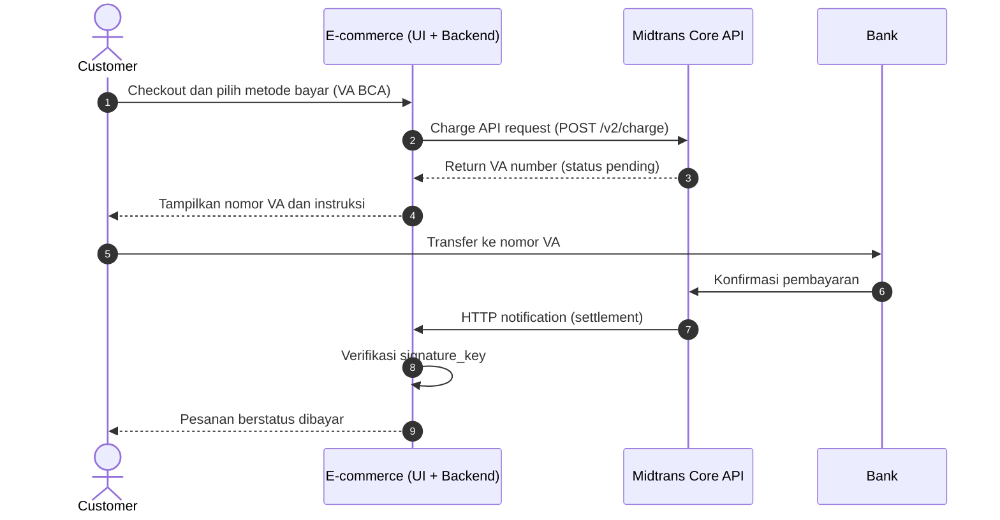

# Midtrans Core API Integration Guide (Custom Interface)

**Kelompok 4 · Business Analyst & Product Strategy Bootcamp (BAPS20) · Basic Software Development**

## Overview and Summary

Dokumen ini adalah panduan integrasi **Midtrans Core API** untuk platform e-commerce. Core API adalah *Custom Interface*: tampilan pembayaran dibuat sendiri oleh e-commerce, sedangkan Midtrans berperan sebagai backend pembayaran. Panduan ini mencakup pembuatan transaksi, pemantauan status pembayaran, pembatalan/kedaluwarsa transaksi, dan pengembalian dana.

**Konteks studi kasus:** platform e-commerce startup belum memiliki sistem pembayaran yang baik sehingga calon pelanggan hilang di tahap pembayaran. Midtrans dipilih karena reputasinya dalam keamanan, keandalan, dan dokumentasi API yang lengkap.

**Ringkasan Core API:**
- RESTful web service dengan payload **JSON**.
- Dapat dipakai di web, aplikasi, POS, atau perangkat lain yang terhubung internet.
- Lingkungan **Sandbox** aktif secara default untuk uji coba; untuk **Production** perlu mengajukan aktivasi Core API.
- Autentikasi memakai **Basic Auth**: Server Key sebagai username, password kosong, lalu di-Base64.

| Lingkungan | Base URL |
|---|---|
| Sandbox | `https://api.sandbox.midtrans.com` |
| Production | `https://api.midtrans.com` |

## Function and Implementation Planning

### Functions of Midtrans Core API

1. **Charge API** (`POST /v2/charge`): Membuat transaksi pembayaran (Virtual Account, QRIS/GoPay, kartu, dan metode lain) dari backend e-commerce.
2. **Get Card Token** (JavaScript library, memakai Client Key): Menukar data kartu menjadi `token_id` di sisi frontend sehingga data kartu tidak melewati server toko.
3. **Get Status API** (`GET /v2/{order_id}/status`): Memeriksa status transaksi terkini.
4. **HTTP Notification (Webhook)**: Midtrans mengirim pemberitahuan ke server e-commerce setiap kali status transaksi berubah.
5. **Cancel API** (`POST /v2/{order_id}/cancel`): Membatalkan transaksi yang belum selesai (mis. status `pending`).
6. **Refund API** (`POST /v2/{order_id}/refund`): Mengembalikan dana untuk transaksi `settlement`, hanya untuk metode yang mendukung (kartu, GoPay, ShopeePay, DANA, OVO, QRIS, Kredivo, Akulaku; **VA bank transfer tidak termasuk**).

> Catatan: endpoint Expire dan Refund sebaiknya dicek ulang di [API Reference Midtrans](https://docs.midtrans.com/reference/api-reference-1) sebelum dipakai.

### Implementation Planning

1. **Start**: Daftar akun Midtrans, masuk ke Sandbox, dan ambil **Server Key** serta **Client Key** di *Settings > Access Keys*.
2. **Aktivasi**: Aktifkan metode pembayaran yang dibutuhkan dan **ajukan aktivasi Core API untuk Production sejak awal** (perlu ditinjau tim Midtrans).
3. **Desain**: Tentukan alur status pesanan (mapping status Midtrans ke status internal), skema database order/payment, dan kebijakan kedaluwarsa serta refund.
4. **Test API Integration**: Bangun backend (Charge, webhook, Get Status) dan UI pembayaran; uji seluruh skenario di Sandbox (sukses, gagal, kedaluwarsa, notifikasi terlambat).
5. **Webhook Setup**: Isi **Payment Notification URL** (HTTPS) di *Settings > Configuration*, lalu implementasikan verifikasi `signature_key`.
6. **Production API Integration**: Ganti key dan base URL ke Production, lakukan soft launch dengan traffic terbatas.
7. **Finish**: Pantau status transaksi dan KPI (payment success rate, conversion rate), lalu rilis ke semua pelanggan.

## Usage Cases

### 1. Automated Payment at Checkout (Virtual Account / QRIS)
**Scenario:** Toko online ingin pelanggan dapat membayar langsung setelah checkout tanpa konfirmasi manual.

- Pelanggan memilih metode bayar di UI toko.
- Backend mengirim **Charge API** dengan detail pesanan.
- Midtrans mengembalikan nomor VA (atau URL QR/deeplink untuk QRIS/GoPay).
- UI menampilkan instruksi pembayaran, lalu status pesanan berubah otomatis setelah notifikasi diterima.

Use case ini mengotomatiskan proses pembayaran, mengurangi konfirmasi manual, dan mempercepat pemrosesan pesanan.

### 2. Real-time Payment Status for Customer Support
**Scenario:** Tim customer support perlu memastikan status pembayaran ketika pelanggan mengaku sudah membayar.

- Sistem menerima **HTTP Notification** dan menyimpan setiap perubahan status.
- Jika notifikasi belum masuk atau tidak jelas, tim memanggil **Get Status API** dengan `order_id`.
- Tim menjawab pelanggan dengan status yang akurat (`pending`, `settlement`, `expire`, dan seterusnya).

Use case ini meningkatkan efisiensi support dan mencegah pesanan "nyangkut" pada status yang salah.

### 3. Card Payment with 3D Secure on a Custom Checkout
**Scenario:** Toko ingin menerima kartu kredit/debit dengan form pembayaran yang sesuai brand.

- Frontend mengambil `token_id` kartu memakai Client Key.
- Backend memanggil **Charge API** dengan `token_id`.
- Jika respons berisi `redirect_url`, pelanggan diarahkan ke halaman **3DS** untuk autentikasi.
- Hasil akhir diterima melalui notifikasi.

Use case ini memberi pengalaman pembayaran kartu yang konsisten dengan tampilan toko tanpa data kartu melewati server sendiri.

### 4. Cancellation, Expiry, and Refund
**Scenario:** Pelanggan membatalkan pesanan atau tidak membayar sampai batas waktu.

- Jika pesanan dibatalkan sebelum dibayar, backend memanggil **Cancel API**.
- Jika melewati batas waktu, Midtrans mengirim notifikasi `expire` dan stok dikembalikan.
- Untuk pembayaran yang sudah `settlement`, tim memakai **Refund API** (jika metode mendukung) atau prosedur refund manual.

Use case ini menjaga data stok dan pembukuan tetap akurat.

## Sequence Diagram



Penjelasan alur interaksi antara Customer, E-commerce platform, dan Midtrans:

1. **User - Checkout -> Ecom**
   Pelanggan menyelesaikan checkout dan memilih metode pembayaran di UI e-commerce.

2. **Ecom - Charge API request -> Midtrans**
   Backend e-commerce mengirim permintaan `POST /v2/charge` berisi `payment_type`, `order_id`, dan `gross_amount` (autentikasi memakai Server Key).

3. **Midtrans - Return VA number -> Ecom**
   Midtrans membuat transaksi dan mengembalikan nomor VA dengan status `pending`.

4. **Ecom - Tampilkan instruksi -> User**
   E-commerce menampilkan nomor VA dan batas waktu pembayaran kepada pelanggan.

5. **User - Transfer -> Bank -> Midtrans**
   Pelanggan membayar melalui bank; bank mengonfirmasi pembayaran ke Midtrans.

6. **Midtrans - HTTP notification -> Ecom**
   Midtrans mengirim notifikasi status `settlement` ke server e-commerce.

7. **Ecom - Verifikasi -> User**
   E-commerce memverifikasi `signature_key`, memperbarui status pesanan, dan memberi tahu pelanggan bahwa pembayaran berhasil.

## Resource Requirements for Midtrans Core API Integration

### Technical Resources

- **Backend Developer(s):** Membuat service Charge, endpoint webhook, sinkronisasi status (Get Status), serta Cancel/Refund.
- **Frontend Developer:** Membuat UI pembayaran per metode (instruksi VA, QR/deeplink, form kartu) dan menangani halaman 3DS.
- **QA/Test Engineer(s):** Menguji skenario di Sandbox (sukses, gagal, kedaluwarsa, notifikasi berulang/terlambat).
- **Development Environment and Tools:** IDE, Git, Postman (tersedia Postman Collection resmi Midtrans), dan endpoint HTTPS publik untuk uji webhook.
- **Access to Midtrans Sandbox and Production:** Akun Midtrans dengan Server Key dan Client Key untuk masing-masing lingkungan.
- **Monitoring & Logging Tools:** Memantau error API, status `pending` yang terlalu lama, dan kegagalan verifikasi signature.
- **Up-to-date API Documentation:** Dokumentasi dan API Reference Midtrans sebagai acuan.

### Non-Technical Resources

- **Project Manager:** Mengoordinasikan tim, jadwal, dan prioritas.
- **Business Analyst:** Menyusun kebutuhan bisnis, alur status pesanan, dan KPI.
- **Finance/Accounting:** Rekonsiliasi transaksi, settlement, dan kebijakan refund.
- **Support Team:** Menangani komplain pembayaran dan berkomunikasi dengan support Midtrans.
- **Legal/Compliance:** Dokumen registrasi merchant, kebijakan privasi, dan kebijakan refund.
- **Communication Channels:** Alur komunikasi antara tim internal dan Midtrans.

## Suggested Timeline for Integration

*(Estimasi berdasarkan asumsi tim kecil; sesuaikan dengan kondisi proyek.)*

| Phase                        | Description                                                       | Duration   |
|------------------------------|-------------------------------------------------------------------|------------|
| Preparation                  | Requirement collection, desain alur status, kebijakan expiry/refund | 1 week     |
| API Access & Setup           | Buat akun, ambil key Sandbox, aktivasi metode, ajukan aktivasi Production | 1 week |
| Development & Integration    | Backend (Charge, webhook, status), frontend (UI per metode, 3DS)  | 3 weeks    |
| Testing                      | Integration test Sandbox, UAT, dan security review                | 2 weeks    |
| Production Deployment        | Ganti key/URL, soft launch, lalu rollout penuh                    | 1 week     |
| Monitoring & Support         | Pemantauan KPI dan perbaikan setelah go-live                      | Ongoing    |

## Pros and Cons

### Pros

- **Kontrol penuh** atas tampilan dan alur pembayaran per metode sehingga konsisten dengan brand.
- Fleksibel: dapat dipakai di web, aplikasi, POS, maupun perangkat lain dengan satu backend.
- Mendukung beragam metode pembayaran (VA, e-wallet, QRIS, kartu, dan lainnya) dengan REST API + JSON.
- Sandbox aktif secara default dan tersedia library serta Postman Collection resmi untuk mempercepat uji coba.
- Dilengkapi endpoint pendukung: status, cancel, expire, refund, dan notifikasi.

### Cons

- Usaha pengembangan dan pemeliharaan lebih besar dibanding Snap atau Payment Link (UI dan alur dibuat sendiri).
- Metode pembayaran baru tidak muncul otomatis; harus diintegrasikan dan diuji satu per satu.
- Beban keamanan dan compliance di sisi merchant lebih besar (terutama untuk kartu); perlu pengelolaan Server Key, verifikasi webhook, dan konfirmasi persyaratan ke Midtrans.
- Aktivasi Production Core API memerlukan proses review.
- Refund via API tidak tersedia untuk semua metode (VA bank transfer tidak termasuk).
- Ketersediaan pembayaran bergantung pada Midtrans dan bank/provider terkait.

## Considerations

- **Keamanan:** Simpan Server Key hanya di backend (environment variable/secret manager), jangan di frontend atau repository publik.
- **Verifikasi notifikasi:** Selalu verifikasi `signature_key` dan pertimbangkan konfirmasi ulang lewat Get Status API.
- **Keandalan webhook:** Notifikasi bisa terlambat atau tidak berurutan; buat penanganan idempotent, respons cepat (di bawah 5 detik), dan job rekonsiliasi untuk transaksi `pending`.
- **Reversal:** Pada beberapa metode (Permata, Mandiri Bill Payment, Indomaret) `settlement` dapat berubah menjadi `deny` dalam kasus jarang; jangan mengirim barang jika status akhirnya `deny`.
- **Expiry:** Default VA 24 jam (dapat diatur) dan GoPay 15 menit; tampilkan hitung mundur di UI dan kembalikan stok saat `expire`.
- **Komunikasi & dokumentasi:** Jaga komunikasi dengan support Midtrans dan pantau perubahan pada dokumentasi/API Reference.
- **Skalabilitas:** Rilis bertahap per metode (VA + QRIS/GoPay lebih dulu, lalu kartu + 3DS) dan siapkan rencana fallback (mis. Payment Link via API) bila terjadi gangguan.

## Sample API Usage

### Request Details

### Endpoint

- **URL (Sandbox)**: `https://api.sandbox.midtrans.com/v2/charge`
- **URL (Production)**: `https://api.midtrans.com/v2/charge`
- **Method**: `POST`
- **Headers**:
  - `Accept: application/json`
  - `Content-Type: application/json`
  - `Authorization: Basic Base64(ServerKey:)` (tanda `:` di akhir wajib disertakan sebelum Base64)

### Request Payload (Virtual Account BCA)

```json
{
  "payment_type": "bank_transfer",
  "transaction_details": {
    "order_id": "ORDER-KLP4-001",
    "gross_amount": 44000
  },
  "item_details": [
    { "id": "ITEM-1", "price": 44000, "quantity": 1, "name": "Produk Contoh" }
  ],
  "customer_details": {
    "first_name": "Budi",
    "email": "budi@example.com",
    "phone": "+628123456789"
  },
  "bank_transfer": { "bank": "bca" }
}
```

> `order_id` harus unik untuk setiap transaksi, dan `gross_amount` sebaiknya sama dengan total `item_details`.

### Example Request in cURL

```bash
curl -X POST https://api.sandbox.midtrans.com/v2/charge \
  -H 'Accept: application/json' \
  -H 'Content-Type: application/json' \
  -H 'Authorization: Basic <BASE64(SERVER_KEY:)>' \
  -d '{"payment_type":"bank_transfer","transaction_details":{"order_id":"ORDER-KLP4-001","gross_amount":44000},"bank_transfer":{"bank":"bca"}}'
```

### Example Request in PHP

```php
<?php

$serverKey = "<< Server Key Sandbox (SB-Mid-server-...) >>";

$data = array(
    'payment_type' => 'bank_transfer',
    'transaction_details' => array(
        'order_id' => 'ORDER-KLP4-001',
        'gross_amount' => 44000
    ),
    'bank_transfer' => array('bank' => 'bca')
);

$ch = curl_init('https://api.sandbox.midtrans.com/v2/charge');
curl_setopt($ch, CURLOPT_RETURNTRANSFER, true);
curl_setopt($ch, CURLOPT_POST, true);
curl_setopt($ch, CURLOPT_HTTPHEADER, array(
    'Accept: application/json',
    'Content-Type: application/json',
    'Authorization: Basic ' . base64_encode($serverKey . ':')
));
curl_setopt($ch, CURLOPT_POSTFIELDS, json_encode($data));

$response = curl_exec($ch);
curl_close($ch);

echo $response;
?>
```

### Signature Verification for HTTP Notification (PHP)

Setiap notifikasi berisi `signature_key` yang dihitung dengan `SHA512(order_id + status_code + gross_amount + ServerKey)`.

```php
<?php

$orderId     = $notification['order_id'];
$statusCode  = $notification['status_code'];
$grossAmount = $notification['gross_amount']; // gunakan string persis seperti di notifikasi
$serverKey   = "<< Server Key >>";

$signature = openssl_digest($orderId . $statusCode . $grossAmount . $serverKey, 'sha512');

if (hash_equals($signature, $notification['signature_key'])) {
    // notifikasi asli dari Midtrans
} else {
    // tolak: signature tidak valid
}
?>
```

### Other Useful Calls

| Tujuan | Request |
|---|---|
| Cek status | `GET https://api.sandbox.midtrans.com/v2/ORDER-KLP4-001/status` |
| Batalkan transaksi pending | `POST https://api.sandbox.midtrans.com/v2/ORDER-KLP4-001/cancel` |
| Bayar via GoPay | `POST /v2/charge` dengan body `{"payment_type":"gopay","transaction_details":{...}}` |
| Bayar via kartu | `POST /v2/charge` dengan `payment_type: credit_card` dan `credit_card.token_id` dari frontend |

### Postman Steps (untuk dokumentasi screenshot)

1. Buat Environment: `base_url`, `server_key`, `client_key`. `[SCREENSHOT 1]`
2. Tab *Authorization*: pilih **Basic Auth**, isi Username dengan Server Key dan Password kosong. `[SCREENSHOT 2]`
3. Kirim `POST {{base_url}}/v2/charge` dengan payload di atas. `[SCREENSHOT 3: request]` `[SCREENSHOT 4: response 201 dengan va_numbers]`
4. Simulasikan pembayaran di Sandbox, lalu cek status di Dashboard atau dengan Get Status. `[SCREENSHOT 5]`

> Jangan menampilkan Server Key asli di screenshot maupun menaruhnya di repository.

## Response Details

### Success Response

*(Ilustrasi bentuk respons berdasarkan dokumentasi; nilai asli akan berbeda saat dijalankan.)*

```json
{
    "status_code": "201",
    "status_message": "Success, Bank Transfer transaction is created",
    "transaction_id": "9aed5972-5b6a-401e-894b-a32c91ed1a3a",
    "order_id": "ORDER-KLP4-001",
    "gross_amount": "44000.00",
    "payment_type": "bank_transfer",
    "transaction_time": "2026-09-20 15:02:22",
    "transaction_status": "pending",
    "va_numbers": [
        {
            "bank": "bca",
            "va_number": "12345678911"
        }
    ],
    "fraud_status": "accept",
    "currency": "IDR"
}
```

### Failed Response

*(Contoh untuk key salah atau tidak sesuai environment; bentuk lengkap dapat berbeda.)*

```json
{
    "status_code": "401",
    "status_message": "Access denied due to unauthorized transaction, please check client key or server key"
}
```

Kesalahan umum lainnya: **402** (*Merchant doesn't have access for this payment type*, metode belum aktif di akun) dan **411** (*Token id is missing, invalid, or timed out*, token kartu tidak valid atau kedaluwarsa).

### Notification (Webhook) Payload

```json
{
    "transaction_time": "2026-09-20 15:10:05",
    "transaction_status": "settlement",
    "transaction_id": "9aed5972-5b6a-401e-894b-a32c91ed1a3a",
    "status_message": "midtrans payment notification",
    "status_code": "200",
    "signature_key": "<hash SHA512>",
    "payment_type": "bank_transfer",
    "order_id": "ORDER-KLP4-001",
    "gross_amount": "44000.00",
    "fraud_status": "accept",
    "currency": "IDR"
}
```

## Explanation of Fields

- `status_code`: Hasil dari **aksi API yang sedang dijalankan** (mirip kode HTTP), bukan status pembayaran. Contoh: `201` berarti transaksi berhasil dibuat.
- `status_message`: Deskripsi hasil aksi API.
- `transaction_id`: ID unik transaksi dari Midtrans.
- `order_id`: ID pesanan dari sistem e-commerce (harus unik).
- `gross_amount`: Total pembayaran dalam IDR (string dengan dua desimal).
- `payment_type`: Metode pembayaran yang dipakai (mis. `bank_transfer`, `gopay`, `credit_card`).
- `transaction_time`: Waktu transaksi dibuat.
- `transaction_status`: Status pembayaran.
  - `pending`: menunggu pembayaran pelanggan.
  - `settlement`: pembayaran berhasil dan dana diterima.
  - `capture`: pembayaran kartu berhasil (akan settle sesuai jadwal bank).
  - `deny`: ditolak oleh provider atau sistem deteksi fraud.
  - `cancel`: dibatalkan.
  - `expire`: melewati batas waktu pembayaran.
  - `refund` / `partial_refund`: dana dikembalikan sebagian atau seluruhnya.
- `va_numbers`: Daftar nomor Virtual Account.
  - `bank`: bank penerbit VA.
  - `va_number`: nomor VA yang dibayar pelanggan.
- `fraud_status`: Hasil deteksi fraud (`accept` berarti disetujui; `challenge` perlu ditinjau).
- `signature_key`: Hash `SHA512(order_id + status_code + gross_amount + ServerKey)` untuk memverifikasi keaslian notifikasi.
- `currency`: Mata uang transaksi (`IDR`).

**Kondisi sukses pada notifikasi:** `status_code` = `200`, `fraud_status` = `accept` (jika ada), dan `transaction_status` = `settlement` atau `capture`.

## Conclusion

Mengintegrasikan Midtrans Core API memberi bisnis kontrol penuh atas pengalaman pembayaran: UI dibuat sesuai brand, alur disesuaikan per metode, dan status pesanan diperbarui otomatis melalui notifikasi. Sebagai imbalannya, tim harus siap dengan usaha pengembangan, pengujian, dan tanggung jawab keamanan yang lebih besar dibanding Snap atau Payment Link.

Kunci keberhasilan adalah mengikuti tahapan implementasi (Sandbox terlebih dahulu, lalu Production), memverifikasi setiap notifikasi, mengelola siklus status transaksi dengan benar, serta merilis secara bertahap per metode pembayaran. Dengan cara ini, bisnis dapat mengurangi kehilangan pelanggan di tahap pembayaran dan meningkatkan tingkat keberhasilan transaksi.

Untuk petunjuk penggunaan lengkap, contoh, dan deskripsi kode error, lihat dokumentasi resmi: [Midtrans Documentation](https://docs.midtrans.com/) · [Payment Overview](https://docs.midtrans.com/docs/payment-overview) · [Core API](https://docs.midtrans.com/docs/custom-interface-core-api) · [HTTP Notification](https://docs.midtrans.com/docs/https-notification-webhooks) · [Transaction Status Cycle](https://docs.midtrans.com/docs/transaction-status-cycle)
